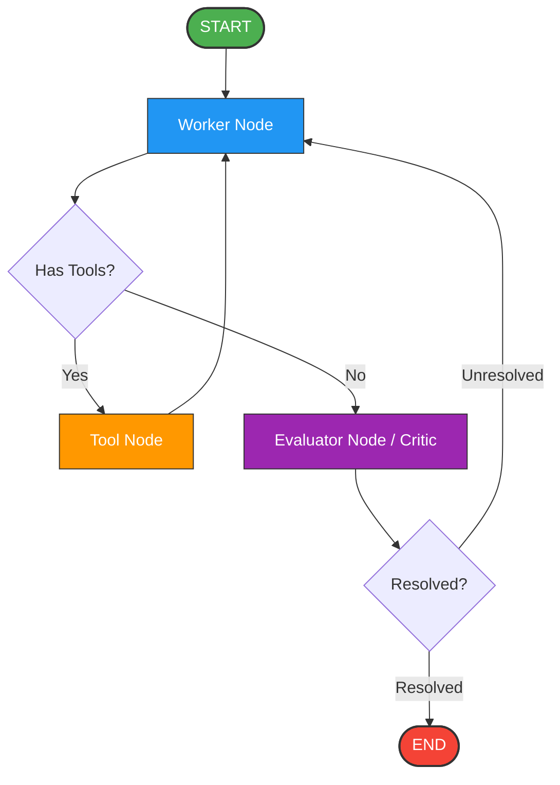

[](https://www.python.org)
[](https://langchain-ai.github.io/langgraph/)
[](https://smith.langchain.com)
[](https://www.mongodb.com/atlas)
[](https://www.pinecone.io)
[](https://github.com/astral-sh/uv)
[](#)
[](https://serper.dev)

# Vantage AI: Advanced Stateful Critic-Worker Agentic Assistant

Vantage AI is a production-grade, stateful AI assistant built using an advanced Critic-Worker architecture powered by LangGraph and served through an asynchronous Gradio web interface.

This project goes beyond traditional linear chatbot interactions. It implements a multi-node cyclical graph that dynamically utilizes specialized system tools, evaluates its own performance against programmatic success criteria, and retains long-term memory across isolated user sessions using a cloud-hosted MongoDB checkpointer.

---

## 🏗️ Architectural Overview

Vantage AI leverages LangGraph to build a deterministic state machine for a multi-turn, multi-agent conversation flow. The workflow operates as an autonomous loop:



### The State Machine Nodes

* **Worker Node:** Takes the user's prompt and determines the appropriate path of execution. It wraps an LLM (`gemma4:31b-cloud`) bound to an expansive array of functional tools.
* **Tool Node:** An isolated execution layer that safely fires synchronous or asynchronous external APIs or web browser actions.
* **Evaluator Node (The Critic):** An independent instantiation of the LLM utilizing Pydantic Structured Outputs (`with_structured_output`). It critiques the worker's output against strict success criteria, forcing a cycle refinement or halting the engine if further clarification from the user is required.

---

## 🛠️ The Custom Tool Belt

Vantage AI has deep environment awareness and can alter its execution using a customized suite of extensions:

| Tool | Core Capability | Under-The-Hood Mechanics |
| :--- | :--- | :--- |
| **Playwright Automation** | Full headless web interaction | Dynamically spawns chromium instances using `PlayWrightBrowserToolkit` to browse, read, and interpret modern SPA web assets. |
| **Enterprise RAG** | Proprietary corporate lookup | Implements a dense semantic search pipeline using HuggingFace's `nomic-ai/nomic-embed-text-v1.5` embeddings against a Pinecone Vector Index. |
| **Deterministic Time Engine** | International Chronology Validation | Bypasses traditional LLM math/logic hallucinations for live schedules via the python `zoneinfo` package and IANA timezone configurations. |
| **Web Search & Discovery** | Public internet retrieval | Proxies external live context queries through the `GoogleSerperAPIWrapper` and Wikipedia APIs. |
| **Push Notifications** | Real-time event broadcasting | Pushes transactional system milestones asynchronously to the user's mobile device/desktop via webhooks to an `ntfy` server destination. |

---

## 🧠 Technical Highlights & Engineering Challenges

Building this project required addressing a series of real-world distributed AI engineering challenges.

### 1. The Challenge of Async Resource Leaks in Ephemeral Spaces
* **The Problem:** Integrating Playwright's asynchronous browser lifecycle with Gradio's long-lived connection states caused headless Chromium zombies to remain in memory after a user closed or refreshed their web tab. This exhausted Hugging Face Space memory limits.
* **The Solution:** Mastered Gradio's state-management hooks by registering a clean teardown sequence directly inside `gr.State(delete_callback=free_resources)`. This triggers an explicit async lifecycle callback that invokes `browser.close()` and stops the Playwright driver gracefully whenever a session expires or is dropped by the client.

### 2. Eliminating Time-Arithmetic Hallucinations
* **The Problem:** LLMs are notoriously poor at mental timezone calculations, shifting global sports broadcasts or cross-border calendar events by days or hours based on their training cutoffs.
* **The Solution:** Designed a strict Time Reasoning System prompt layer coupled with a dedicated `get_current_time_for_timezone` utility. The Evaluator agent actively penalizes the Worker agent if it attempts to guess times in target markets (e.g., Tokyo, London, New York) rather than resolving them deterministically using structured programmatic inputs.

### 3. State Continuity Across Distributed Environments
* **The Problem:** Relying on in-memory checkpoints (`MemorySaver`) results in complete loss of conversation tracking when scaling a system across multiple containers or deploying it to volatile cloud environments like Hugging Face Spaces.
* **The Solution:** Replaced ephemeral storage mechanisms with an enterprise checkpointer implementation using `MongoDBSaver`. Coupled with generating an isolated session UUID (`thread_id`) on initial app payload delivery, user states remain beautifully isolated, persistent, and secure across multiple requests.

---

## 🚀 Quickstart & Setup

This repository leverages `uv`, the ultra-fast Python package and project manager developed by Astral.

### Prerequisites
Ensure you have `uv` installed, along with access to a MongoDB instance (such as MongoDB Atlas) and required LLM credentials.

### Installation

1. Clone the project repository and navigate to the directory:
    ```bash
    git clone <repository_url>
    cd vantage-ai
    ```

2. Synchronize project dependencies and initialize the virtual environment using `uv`:
    ```bash
    uv sync
    ```

3. Configure your local configuration file. Create a `.env` file in the root directory:
    ```env
    SERPER_API_KEY="<serper_api_key_from_google_serper>"
    NTFY_URL="[https://ntfy.sh/your_custom_topic](https://ntfy.sh/your_custom_topic)"
    MONGODB_URI="mongodb+srv://<username>:<password>@cluster.mongodb.net/vantage_db"
    PINECONE_API_KEY="<pinecone_api_key_after_setup>"
    HF_TOKEN="your_huggingface_write_token_if_needed"

    # If you would like to enable langsmith tracing and monitoring, you can visit Langsmith, setup your account and add the following:
    LANGSMITH_TRACING=true
    LANGSMITH_ENDPOINT=https://api.smith.langchain.com
    LANGSMITH_API_KEY="<langsmith_api_key_after_setup>"
    LANGSMITH_PROJECT="<project_name>"
    ```

4. Launch the application:
    ```bash
    uv run AI_Assistant.py
    ```

---

## 🚧 Roadmap & Work In Progress

* **Advanced MongoDB Checkpoint Eviction (TTL / Data Retention Logic):** Currently, chat history checkpoints scale monotonically within the MongoDB database cluster. Developing an automated Time-To-Live (TTL) or data pruning script to safely purge historical session workflows while maintaining warm active states is actively under development.